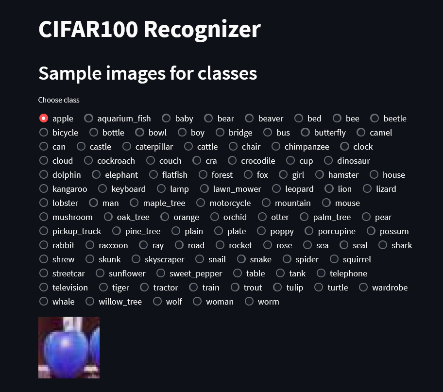

# CIFAR100 dataset

## <span style="color:red">About dataset</span>

### <span style="color:green">Cifar100</span>

This dataset is just like the CIFAR-10, except it has 100 classes containing 600 images each. There are 500 training images<br>
and 100 testing images per class. The 100 classes in the CIFAR-100 are grouped into 20 superclasses. Each image comes with a<br>
"fine" label (the class to which it belongs) and a "coarse" label (the superclass to which it belongs).<br>
Here is the list of classes in the CIFAR-100:

### Usage of [Streamlit](https://github.com/streamlit/streamlit.git)

```
streamlit run stream.py
```

The result is as follows:

<a></a>

# <span style="color:red">Models</span>

Datasets is trained with tensorflow API. GPU is recommended for this datasets. Because it takes a lot of time on cpu.<br>
Models in [google drive](https://drive.google.com/drive/folders/10L17l5w_5FTeBU-Q4Ezh6Hs_zITtCKW7?usp=sharing).

## Features

### Deep Learning

- we have deep neural network with keras in [tensorflow](https://github.com/tensorflow/tensorflow.git)

## Installation

Install python and:

```
pip install -r requirements.txt
```
